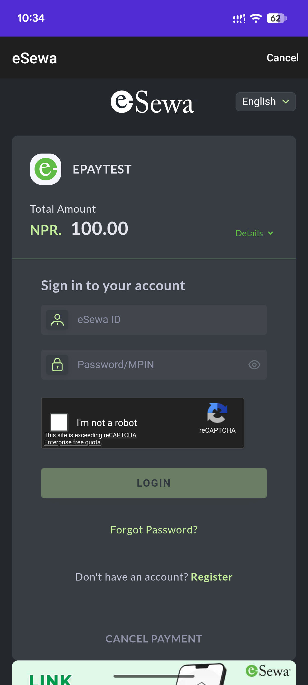

[](https://www.nuget.org/packages/esewa_maui/)
[](https://www.nuget.org/packages/esewa_maui.epay/)

Accept **eSewa** payments in your .NET MAUI app on **Android** and **iOS**. Two
packages are available — pick the one that fits your app:

| | **esewa_maui** | **esewa_maui.epay** |
| --- | --- | --- |
| How | Binds the **official native eSewa SDKs** (Android AAR + iOS `xcframework`) | Pure C# **ePay v2** hosted checkout (opens eSewa's page in a WebView) |
| UI | Native eSewa screens | eSewa's hosted web page |
| **App size** | Larger — bundles the native SDK binaries | **Minimal** — managed C# only, no native binaries |
| Extra setup | None | None |
| API | `EsewaPayment.Current.PayAsync(...)` | `EsewaEpay.Current.PayAsync(...)` |

### Which should I use?

- Use **`esewa_maui`** if you want the native eSewa UI/experience embedded in
  your app.
- Use **`esewa_maui.epay`** if **app size matters**. The native SDKs add several
  MB to your app (the iOS `xcframework` in particular). `esewa_maui.epay` ships
  only managed code and drives eSewa's web checkout, so it adds virtually
  nothing to your binary — a good option when you want a lightweight
  integration.

Both target .NET MAUI (.NET 10+), Android API 24+, and iOS 13.0+.

---

# esewa_maui — native SDK binding

<table>
  <tr>
    <td align="center"><br/>Android</td>
    <td width="32"></td>
    <td align="center"><br/>iOS</td>
  </tr>
</table>

```bash
dotnet add package esewa_maui
```

The native SDKs and their dependencies are included — no manifest edits, no
`Info.plist` changes.

> **Android:** set your app's minimum SDK to **24+** (the eSewa SDK's UI
> components require it).

```csharp
using Plugin.Esewa;

var result = await EsewaPayment.Current.PayAsync(new EsewaPaymentRequest
{
    ClientId    = "<your-merchant-client-id>",
    SecretKey   = "<your-merchant-secret>",
    Amount      = "100",
    ProductName = "Premium Subscription",
    ProductId   = "TXN-1001",
    CallbackUrl = "https://your-merchant.com/callback",
    Environment = EsewaEnvironment.Production,
});

if (result.IsSuccess)
    await DisplayAlert("Success", result.Message, "OK");
```

### API

| Member | Description |
| --- | --- |
| `EsewaPayment.Current` / `.IsSupported` | Entry point (Android + iOS). |
| `EsewaPaymentRequest` | `ClientId`, `SecretKey`, `Amount`, `ProductName`, `ProductId`, `CallbackUrl`, `Environment` (`Test`/`Production`), `Properties`. |
| `EsewaPaymentResult` | `Status` (`Success`/`Cancelled`/`Failure`), `IsSuccess`, `Message`, `Details`. |

---

# esewa_maui.epay — ePay v2 (lightweight)

<table>
  <tr>
    <td align="center"><br/>Android</td>
  </tr>
</table>

```bash
dotnet add package esewa_maui.epay
```

No native binding — it opens eSewa's hosted ePay v2 checkout in a WebView,
verifies the signed result, and confirms it against the transaction status API.

```csharp
using Plugin.Esewa.Epay;

var result = await EsewaEpay.Current.PayAsync(new EsewaEpayRequest
{
    Amount      = 100,
    ProductCode = "<your-merchant-code>",   // "EPAYTEST" in sandbox
    SecretKey   = "<your-merchant-secret>",
    Environment = EsewaEpayEnvironment.Production,
});

if (result.IsSuccess)
    await DisplayAlert("Success", $"ref {result.TransactionCode}", "OK");
```

### API

| Member | Description |
| --- | --- |
| `EsewaEpay.Current` / `.IsSupported` | Entry point (Android + iOS). |
| `EsewaEpayRequest` | `Amount` (+ `TaxAmount`/`ServiceCharge`/`DeliveryCharge`), `ProductCode`, `SecretKey`, `TransactionUuid?`, `Environment`, `SuccessUrl`/`FailureUrl`, `VerifyStatus`. |
| `EsewaEpayResult` | `Status` (`Complete`/`Pending`/`Cancelled`/`Failed`/`Refunded`/`Unknown`), `IsSuccess`, `TransactionUuid`, `TransactionCode`, `TotalAmount`, `Details`. |

Sandbox: `ProductCode = "EPAYTEST"`, `SecretKey = "8gBm/:&EnhH.1/q"`,
`Environment = EsewaEpayEnvironment.Sandbox`.

---

## Getting merchant credentials

Sign up and manage your merchant keys / product codes on the official eSewa
developer portal: **<https://developer.esewa.com.np/>**. Use the sandbox
credentials while developing, then switch to `Production` with your live keys.

## Example app

[`samples/EsewaSample`](samples/EsewaSample) is a MAUI app that demonstrates
**both** packages side by side — a "Native SDK" button and an "ePay v2 / Web"
button feeding a shared result panel.

## License

Released under the **MIT License** — see [LICENSE](LICENSE).

> The MIT license covers these plugins. eSewa, its SDKs, and its gateway are the
> property of eSewa and subject to eSewa's own terms; see
> <https://developer.esewa.com.np/>.
