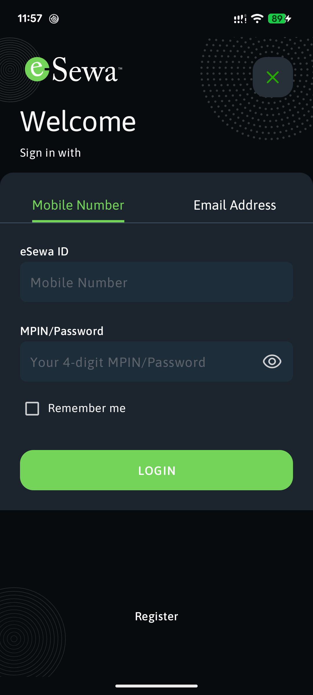
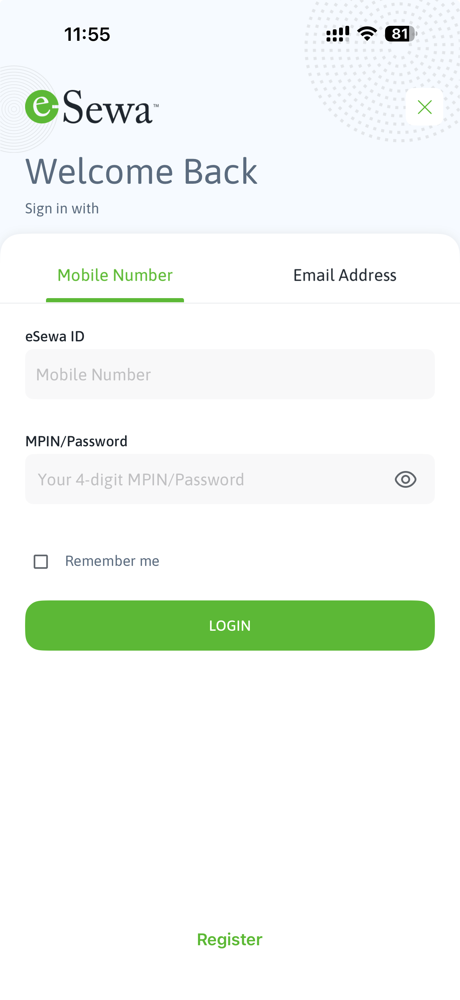

[](https://www.nuget.org/packages/esewa_maui/)

Accept **eSewa** payments in your .NET MAUI app with a single, async call.
`esewa_maui` wraps the official native eSewa SDKs on **Android** and **iOS** and
exposes one cross-platform C# API.

```csharp
var result = await EsewaPayment.Current.PayAsync(new EsewaPaymentRequest
{
    ClientId    = "<your-merchant-client-id>",
    SecretKey   = "<your-merchant-secret>",
    Amount      = "100",
    ProductName = "Premium Subscription",
    ProductId   = "TXN-1001",
    CallbackUrl = "https://your-merchant.com/callback",
    Environment = EsewaEnvironment.Production,
});

if (result.IsSuccess)
    await DisplayAlert("Success", result.Message, "OK");
```

## Preview

<table>
  <tr>
    <td align="center"><br/>Android</td>
    <td width="40"></td>
    <td align="center"><br/>iOS</td>
  </tr>
</table>

## Requirements

| | |
| --- | --- |
| Framework | .NET MAUI (.NET 10+) |
| Android | API 24 (Android 7.0) or higher |
| iOS | 13.0 or higher |

## Installation

```bash
dotnet add package esewa_maui
```

Or via the Package Manager:

```powershell
Install-Package esewa_maui
```

That's it — the native SDKs and their dependencies are included in the package.
No manifest edits, no `Info.plist` changes, no extra native setup required.

> **Android:** make sure your app's minimum SDK is **24 or higher**
> (`<SupportedOSPlatformVersion>` for the `-android` target). The eSewa SDK's
> UI components require it.

## Usage

Call it from anywhere with an active screen (a page, a view model command, etc.):

```csharp
using Plugin.Esewa;

async Task PayAsync()
{
    if (!EsewaPayment.IsSupported)
        return; // Not running on Android or iOS.

    var request = new EsewaPaymentRequest
    {
        ClientId    = "<your-merchant-client-id>",
        SecretKey   = "<your-merchant-secret>",
        Amount      = "500",
        ProductName = "Order #1234",
        ProductId   = "ORD-1234",
        CallbackUrl = "https://your-merchant.com/callback",
        Environment = EsewaEnvironment.Production,
    };

    EsewaPaymentResult result = await EsewaPayment.Current.PayAsync(request);

    switch (result.Status)
    {
        case EsewaPaymentStatus.Success:
            // result.Message and result.Details carry the transaction info.
            break;
        case EsewaPaymentStatus.Cancelled:
            // The user backed out of the payment.
            break;
        case EsewaPaymentStatus.Failure:
            // result.Message explains what went wrong.
            break;
    }
}
```

`PayAsync` presents the native eSewa checkout UI and completes when the user
finishes, cancels, or an error occurs. It never throws for a normal
cancellation or decline — inspect `result.Status`.

## API

### `EsewaPayment`

| Member | Description |
| --- | --- |
| `EsewaPayment.Current` | The payment service for the current platform. |
| `EsewaPayment.IsSupported` | `true` on Android and iOS. |

### `EsewaPaymentRequest`

| Property | Required | Description |
| --- | --- | --- |
| `ClientId` | ✔ | Merchant client id issued by eSewa. |
| `SecretKey` | ✔ | Merchant secret key issued by eSewa. |
| `Amount` | ✔ | Amount to charge, e.g. `"100"`. |
| `ProductName` | ✔ | Product / service name shown to the payer. |
| `ProductId` | ✔ | Your unique id for this transaction. |
| `CallbackUrl` | ✔ | Callback URL registered with eSewa. |
| `Environment` | | `Test` (default) or `Production`. |
| `Properties` | | Optional extra key/value pairs forwarded to the SDK. |

### `EsewaPaymentResult`

| Member | Description |
| --- | --- |
| `Status` | `Success`, `Cancelled`, or `Failure`. |
| `IsSuccess` | Shortcut for `Status == Success`. |
| `Message` | Human-readable message from the SDK. |
| `Details` | Key/value transaction details on success (may be `null`). |

## Getting merchant credentials

You need a merchant **client id**, **secret key**, and a registered **callback
URL** from eSewa. Sign up and manage these on the official developer portal:

**<https://developer.esewa.com.np/>**

Use `EsewaEnvironment.Test` with sandbox credentials during development, then
switch to `EsewaEnvironment.Production` with your live credentials to go live.

## Example app

A complete working sample is in [`samples/EsewaSample`](samples/EsewaSample) —
a MAUI app that collects payment details and calls `PayAsync` from a button.

## License

Released under the **MIT License** — see [LICENSE](LICENSE).

> The MIT license covers this plugin. The bundled native eSewa SDKs are the
> property of eSewa and are subject to eSewa's own licensing terms; see
> <https://developer.esewa.com.np/>.
